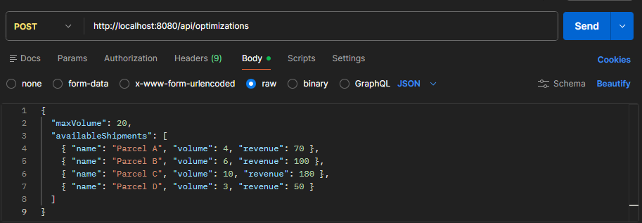
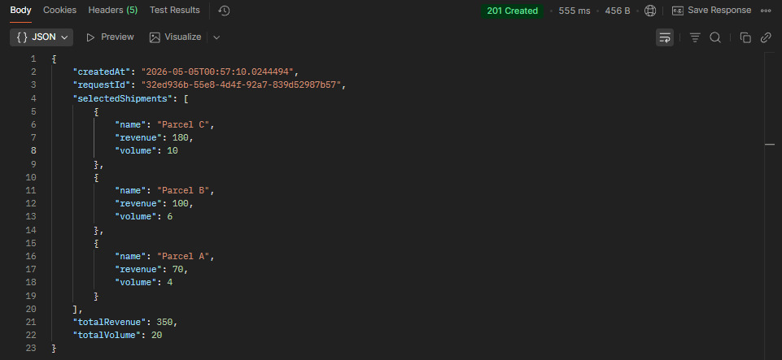
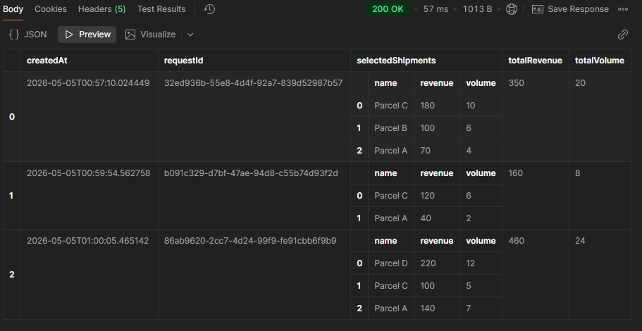
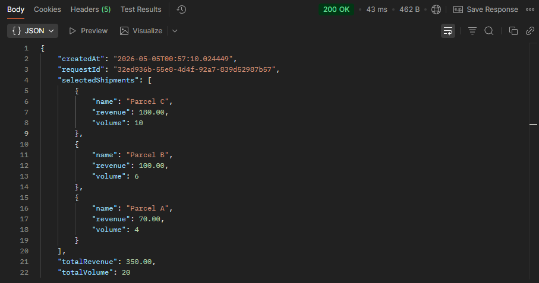
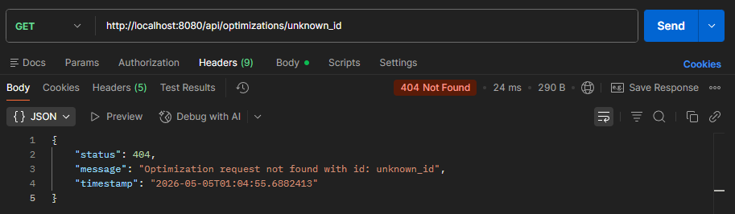

# Van Loading Optimiser

## 1. Build and Run

### Prerequisites

- Java 17 (Temurin JDK 17)
- Maven 3.9+
- Docker Desktop (for production profile)

### Steps

```bash
# Clone repository
git clone https://github.com/nikusha09/Cargo-Shipments.git
cd Cargo-Shipments

# Build the project
mvn clean install

# Run with dev profile (H2 in-memory database)
mvn spring-boot:run -Dspring-boot.run.profiles=dev

# Run with prod profile (PostgreSQL via Docker)
mvn spring-boot:run -Dspring-boot.run.profiles=prod

# Or change profile in application.properties through spring.profiles.active=prod/dev
# Also can run the app via intellij run button instead of mvn spring-boot:run

```

Application will be available at: `http://localhost:8080`

---

## 2. Database Setup

### Dev Profile (H2 — no setup required)

H2 is an in-memory database that starts automatically with the application. No installation or configuration needed.

H2 Console available at: `http://localhost:8080/h2-console`
- JDBC URL: `jdbc:h2:mem:cargodb`
- Username: `sa`
- Password: *(empty)*

### Prod Profile (PostgreSQL via Docker)

#### Requirements
- Docker Desktop installed and running

#### Steps

```bash
# Start PostgreSQL container
docker compose up -d

# Stop PostgreSQL container (data is preserved)
docker compose down

# Stop and delete all data
docker compose down -v
```

#### Configuration

Create a `.env` file in the project root with your credentials:

```env
CONTAINER_NAME=your-container-name
DB_NAME=your_db_name
DB_USER=your_username
DB_PASSWORD=your_password
```

#### Schema Migrations

Flyway runs automatically on application startup — no manual migration commands needed. All tables are created automatically.

---

## 3. API Endpoints

### Endpoint 1: Run Optimization

**POST** `/api/optimizations`

**Request**



**Response**



---

### Endpoint 2: Get All Optimizations

**GET** `/api/optimizations`

**Request**


**Response**

list of all shipment requests




---

### Endpoint 3: Get Optimization By ID

**GET** `/api/optimizations/{id}`

**Request**


**Response**



**Error Response (404)**



---

## 4. Database Schema Design

### Overview

The schema consists of two tables representing a one-to-many relationship — one optimization request can have many selected shipments.

### Tables

- **optimization_requests**: Stores each optimization run — the request parameters (maxVolume), results (totalVolume, totalRevenue), and metadata (UUID, createdAt)
- **selected_shipments**: Stores each shipment selected by the algorithm for a given optimization request, linked via foreign key

### Schema

```sql
optimization_requests
---------------------
id VARCHAR(36) PRIMARY KEY        -- UUID generated by application
max_volume INTEGER NOT NULL       -- van capacity from request
total_volume INTEGER NOT NULL     -- sum of selected shipments volume
total_revenue DECIMAL(19,2)       -- sum of selected shipments revenue
created_at TIMESTAMP NOT NULL     -- when the optimization was run

selected_shipments
------------------
id BIGINT PRIMARY KEY             -- auto-generated internal ID
name VARCHAR(255) NOT NULL        -- shipment label
volume INTEGER NOT NULL           -- shipment volume in dm³
revenue DECIMAL(19,2) NOT NULL    -- shipment delivery fee
optimization_request_id VARCHAR(36) NOT NULL  -- FK to optimization_requests
```

### Indexing Strategy

- **`idx_selected_shipments_request_id`** — index on `selected_shipments.optimization_request_id` for fast lookup of all shipments belonging to a specific optimization request (most frequent join operation)
- **`idx_optimization_requests_created_at`** — index on `optimization_requests.created_at` for efficient filtering and sorting by date (useful for audit queries like "show requests from today")
- Primary keys (`id`) are automatically indexed by the database

### Design Decisions

- UUID used as primary key for `optimization_requests` — safe to expose publicly, unpredictable, and avoids leaking information about data volume
- `DECIMAL(19,2)` used for revenue — never use floating point types for currency to avoid rounding errors
- `CascadeType.ALL` on the one-to-many relationship — saving an optimization request automatically saves its selected shipments in a single transaction
- Flyway used for versioned schema migrations — ensures schema is consistent across all environments (dev, prod)
